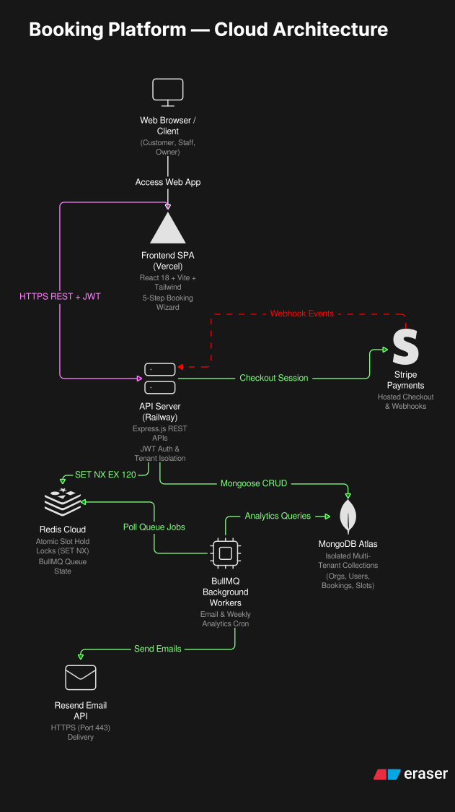

# 🗓️ AppointFlow — Multi-Tenant Appointment Booking SaaS Platform

[](https://react.dev/)
[](https://www.typescriptlang.org/)
[](https://vitejs.dev/)
[](https://tailwindcss.com/)
[](https://tanstack.com/query/latest)
[](https://nodejs.org/)
[](https://expressjs.com/)
[](https://www.mongodb.com/)
[](https://redis.io/)
[](https://bullmq.io/)
[](https://stripe.com/)
[](https://resend.com/)
[](https://vitest.dev/)

**AppointFlow** is an enterprise-ready, multi-tenant Appointment Scheduling & Booking SaaS platform. It combines high-concurrency slot reservations with atomic Redis locks, automated BullMQ asynchronous background workers, cryptographically verified Stripe checkout, and a responsive, high-performance React 18 + TypeScript SPA.

---

## 📑 Table of Contents
1. [Key Features & Capabilities](#-key-features--capabilities)
2. [System Architecture](#-system-architecture)
3. [Tech Stack](#-tech-stack)
4. [Project Structure](#-project-structure)
5. [Quick Start & Local Setup](#-quick-start--local-setup)
6. [Environment Variables](#-environment-variables)
7. [API Contract & Quirks Matrix](#-api-contract--quirks-matrix)
8. [Background Queues & Workers](#-background-queues--workers)
9. [Testing & Build Verification](#-testing--build-verification)
10. [Production Deployment Guide](#-production-deployment-guide)
11. [License](#-license)

---

## 🌟 Key Features & Capabilities

### 🏢 1. True Multi-Tenancy
* **Data Model Isolation**: Strict tenant segregation (`orgId`) enforced across all MongoDB models (`Org`, `User`, `Service`, `Availability`, `Booking`, `Revenue`, `Stats`).
* **Slug Routing**: Public booking flows support direct slug-based and organization-scoped identifiers (`/book?org=<slug_or_id>`).
* **Multi-Tier Plans**: Tiered subscription structures (`Free`, `Pro`, `Enterprise`) for tenant organizations.

### 👥 2. Role-Based Access Control (RBAC)
* **👑 Business Owner (Admin)**:
  * Master performance analytics (bookings today, projected trends, revenue vs. prior period).
  * Full CRUD management for service offerings, durations, and pricing.
  * Team onboarding and staff credential provisioning.
  * Master bookings ledger with status management and **CSV export**.
  * 1-Click shareable public booking link generator with instant clipboard copy.
* **👨‍💼 Staff Providers**:
  * Dedicated schedule view with **"Today's Agenda"** priority card and 1-click status completion.
  * Recurring weekly availability configuration (open hours per day of week).
  * Dynamic date-range slot generator matrix.
* **🙋 Customers**:
  * 5-step progressive booking wizard.
  * Complimentary ($0) direct confirmation or Stripe payment checkout.
  * Personal booking history with active and past appointment tracking.
  * 1-Click **"Add to Google Calendar"** and **Apple / Outlook `.ics` download**.

### ⚡ 3. Concurrency Safety & Slot Reservation Locks
* **Atomic Redis Hold Locks**: During checkout, an atomic 2-minute hold (`hold:<slotId>`) prevents double-bookings under concurrent client traffic.
* **Live UI Hold Countdown**: Interactive countdown timer badge displays remaining hold time before releasing the lock back into the pool.
* **Automatic Hold Release**: If the user cancels, abandons, or the checkout session expires, the lock is automatically lifted in Redis.

### 💳 4. Stripe Checkout & Cryptographic Webhooks
* Seamless Stripe Hosted Checkout for credit cards, Apple Pay, and Google Pay.
* Idempotent webhook verification using `stripe.webhooks.constructEvent` with `STRIPE_WEBHOOK_SECRET`.
* Automatic booking state transition (`pending` $\rightarrow$ `confirmed`) and atomic revenue incrementing upon `checkout.session.completed`.

### 📬 5. BullMQ Asynchronous Job Queues
* **Email Queue (`email-queue`)**: Asynchronous booking confirmation emails, cancellation notices, and delayed **24-hour appointment reminders**.
* **Report Queue (`report-queue`)**: Weekly cron job computing weekly revenue and booking summaries for business owners.
* **Cache Queue (`cache-queue`)**: Nightly cron job warming the upcoming 7-day slot availability cache.

### 🎨 6. Modern Frontend Ergonomics
* **Dark / Light Theme**: Contrast-tuned design tokens with smooth transitions.
* **Form Accessibility**: Interactive password visibility toggles (`Eye` / `EyeOff`), focus rings, and inline validation with **React Hook Form + Zod**.
* **Time-of-Day Slot Bucketing**: Slots automatically bucketed into 🌅 **Morning**, ☀️ **Afternoon**, and 🌙 **Evening** tabs.
* **Mobile-First Responsive UI**: Full responsive layout with collapsible navigation and touch-optimized action buttons.

---

## 📐 System Architecture

<div align="center">
  
</div>

The architecture leverages a decoupled, multi-tier cloud infrastructure:
1. **Client / Presentation Layer (Vercel)**: React 18 + Vite SPA serving role-based portals (Customer, Staff, Owner) and a 5-step guided booking wizard with an inline authentication gate.
2. **API & Application Layer (Railway)**: Express 5.x REST API orchestrator handling JWT authentication, strict tenant isolation (`orgId`), and centralized error handling.
3. **Async Job Processing (BullMQ)**: Worker engine managing transactional email delivery (Resend HTTPS API) and automated weekly revenue/booking analytics cron jobs.
4. **Data & Cache Layer**:
   * **Redis Cloud**: Distributed lock manager ensuring atomic 2-minute slot reservations (`SET NX EX 120`), BullMQ queue states, and rate limiting counters.
   * **MongoDB Atlas**: Multi-tenant document database with indexed schemas for organizations, users, services, bookings, availability, and revenue metrics.
5. **External Cloud Services**: Stripe Hosted Checkout sessions with cryptographic webhook listeners and Resend for transactional email dispatch.

---

## 💻 Tech Stack

### Frontend
| Layer | Technology |
|---|---|
| Framework & Build | React 18.3, TypeScript 5.6, Vite 5.4 |
| Styling & Theme | Tailwind CSS 3.4, clsx, tailwind-merge |
| State & Caching | TanStack React Query v5 |
| Forms & Validation | React Hook Form 7, Zod 3.23 |
| Routing & Icons | React Router DOM 6, Lucide React |
| Charts & Feedback | Recharts 2.13, Sonner (Toasts) |
| Date Utilities | date-fns 3.6 |

### Backend
| Layer | Technology |
|---|---|
| Runtime & Framework | Node.js 18+, Express 5.x |
| Database & ODM | MongoDB Atlas, Mongoose 8.x |
| Cache & Concurrency | Redis Cloud, ioredis 5.x |
| Background Queues | BullMQ 5.x |
| Security & Auth | JSON Web Tokens (JWT), bcryptjs, Helmet, CORS, Joi |
| Payments | Stripe Node SDK 17.x |
| Mailer Transport | Resend (HTTPS API) with Nodemailer SMTP Fallback |
| Testing | Vitest, Supertest (50 tests passing) |

---

## 📂 Project Structure

```
.
├── src/                               # Express Backend Source
│   ├── config/                        # MongoDB, Redis, and BullMQ client connections
│   ├── controllers/                   # Auth, Availability, Bookings, Checkout, Services, Stats
│   ├── middlewares/                   # JWT Auth, RBAC, Tenant isolation, Rate limiters, Error handling
│   ├── models/                        # Mongoose schemas (Org, User, Service, Booking, Revenue, Stats)
│   ├── queues/                        # BullMQ queues & worker processors (Email, Cache, Report)
│   ├── routes/                        # Express REST route definitions
│   ├── services/                      # Nodemailer SMTP transport service
│   ├── utils/                         # AppError, catchAsync, slot calculation algorithms
│   ├── validations/                   # Joi validation schemas
│   ├── app.js                         # Express application setup & middleware chain
│   └── swagger.yaml                   # OpenAPI 3.0 API specifications
│
├── frontend/                          # Vite + React 18 Frontend
│   ├── src/
│   │   ├── api/                       # Axios API client instances & endpoints
│   │   ├── components/                # Reusable UI primitives (Button, Card, Modal, Badge, etc.)
│   │   ├── contexts/                  # AuthContext and ThemeContext providers
│   │   ├── features/                  # Role-based feature views (auth, owner, staff, customer, wizard)
│   │   ├── hooks/                     # TanStack React Query custom hooks
│   │   ├── lib/                       # Calendar (.ics/Google Cal) & CSV export utilities
│   │   ├── pages/                     # Route entry pages (Landing, Login, GetStarted, Success, 404)
│   │   ├── types/                     # TypeScript API & entity declarations
│   │   ├── App.tsx                    # Route definitions & layout wrappers
│   │   └── main.tsx                   # React root entry point
│   ├── package.json                   # Frontend dependencies & scripts
│   ├── tailwind.config.js             # Tailwind design token configuration
│   ├── tsconfig.json                  # TypeScript compiler options & path aliases
│   └── vite.config.ts                 # Vite server & build settings
│
├── tests/                             # Automated Vitest integration test suite
├── server.js                          # Production server entry point
├── .env.example                       # Backend environment template
├── package.json                       # Backend scripts & dependencies
└── README.md                          # Main project documentation
```

---

## 🚀 Quick Start & Local Setup

### 1. Prerequisites
* **Node.js**: `v18.0.0` or higher
* **MongoDB**: Local MongoDB instance or free [MongoDB Atlas](https://www.mongodb.com/atlas) cluster
* **Redis**: Local Redis instance or free [Redis Cloud](https://redis.io/cloud) instance
* **Stripe Account**: Free [Stripe Developer Account](https://stripe.com) for test API keys

---

### 2. Backend Setup
```bash
# Clone the repository
git clone https://github.com/hammadasdfg6-glitch/appointment-booking-saas.git
cd appointment-booking-saas

# Install backend dependencies
npm install

# Create environment file
cp .env.example .env
```

Edit your `.env` file (see [Environment Variables](#-environment-variables) below), then start the backend server:

```bash
# Start backend in development mode (with auto-reload)
npm run dev

# Or start in production mode
npm start
```
The backend will launch at `http://localhost:5052` (Swagger docs at `http://localhost:5052/api-docs`).

---

### 3. Frontend Setup
In a new terminal window:

```bash
cd frontend

# Install frontend dependencies
npm install

# Start Vite development server
npm run dev
```

Open your browser and navigate to:
👉 **`http://localhost:3000`**

---

## 🔑 Environment Variables

### Backend (`.env`)
```env
# Server Configuration
PORT=5052
NODE_ENV=development
FRONTEND_URL=http://localhost:3000

# Database (MongoDB)
MONGO_URI=mongodb://localhost:27017/appointflow
# Or Atlas: mongodb+srv://<user>:<password>@cluster.mongodb.net/appointflow

# Security & Tokens
JWT_SECRET=your_super_secret_jwt_key_here_min_32_chars

# Cache & Message Broker (Redis)
REDIS_HOST=localhost
REDIS_PORT=6379
REDIS_USERNAME=default
REDIS_PASSWORD=your_redis_password_if_any

# Email Notification Transport (Nodemailer SMTP)
FROM=noreply@appointflow.com
PASS=your_smtp_or_gmail_app_password

# Stripe Payments & Webhooks
STRIPE_SECRET_KEY=sk_test_51...
STRIPE_WEBHOOK_SECRET=whsec_...
```

### Frontend (`frontend/.env`)
```env
# API Gateway URL (defaults to http://localhost:5052 if omitted)
VITE_API_URL=http://localhost:5052
```

---

## 📡 API Contract & Quirks Matrix

### Authentication & Tenant Endpoints
| Method | Endpoint | Access | Key Payload Notes |
|---|---|---|---|
| `POST` | `/auth/orgs` | Public | Body: `{ name, slug, timezone, ownerName, ownerEmail, password, plan }` *(Note: uses `password`)* |
| `POST` | `/auth/login` | Public | Body: `{ email, passwordHash }` *(Note: uses `passwordHash`)* |
| `POST` | `/auth/register` | Public | Body: `{ name, email, passwordHash, orgName }` *(Customer registration)* |
| `POST` | `/auth/orgs/:orgId/staff` | Owner | Body: `{ name, email, passwordHash, role: "staff" }` |
| `POST` | `/auth/reset-password` | Public | Body: `{ email, password }` |
| `GET` | `/auth/me` | Authenticated | Returns authenticated user profile |
| `GET` | `/auth/staff` | Authenticated | Returns users in org *(Client filters `role === 'staff'`)* |
| `POST` | `/auth/logout` | Authenticated | Clears auth cookies and invalidates Redis session |

### Services Endpoints
| Method | Endpoint | Access | Key Payload Notes |
|---|---|---|---|
| `GET` | `/service` | Authenticated | Lists all services for tenant organization |
| `POST` | `/service/create` | Owner | Body: `{ name, description, durationMinutes, price, active }` |
| `PATCH`| `/service/:name` | Owner | Body: `{ name, description, durationMinutes, price, active }` |
| `DELETE`|`/service/:name` | Owner | Deactivates service |

### Availability & Slots
| Method | Endpoint | Access | Key Payload Notes |
|---|---|---|---|
| `GET` | `/availiability/slots` | Authenticated | Query: `?staffId=&date=YYYY-MM-DD` *(Returns 404 on empty slots, handled gracefully)* |
| `POST`| `/availiability/` | Staff/Owner | Body: `{ weeklySchedule: [{ dayOfWeek, isWorking, startTime, endTime, breakStart, breakEnd }] }` |
| `POST`| `/availiability/generate-slots` | Staff/Owner | Body: `{ staffId, startDate, endDate, slotDuration }` |

### Checkout & Bookings
| Method | Endpoint | Access | Key Payload Notes |
|---|---|---|---|
| `POST` | `/checkout/session` | Customer/Owner | Body: `{ serviceId, staffId, slotId, startAt, date }` *(Places 2-min Redis hold)* |
| `GET`  | `/checkout/confirm` | Authenticated | Query: `?session_id=` *(Confirms Stripe transaction)* |
| `POST` | `/checkout/webhook` | Stripe Public | Raw body + `stripe-signature` header |
| `POST` | `/booking` | Customer/Owner | Body: `{ serviceId, staffId, startAt, date }` *(Direct confirmation for free services)* |
| `GET`  | `/booking` | Authenticated | Query: `?page=1&limit=10&status=&date=&staffId=` |
| `PATCH`| `/booking/:id/status` | Staff/Owner | Body: `{ status: "pending" \| "confirmed" \| "completed" \| "cancelled" }` |
| `DELETE`|`/booking/:id` | Authenticated | Cancels appointment and releases slot lock |

---

## 📬 Background Queues & Workers

BullMQ workers run concurrently with the Express server:

```
[BullMQ] Initializing queues...
[BullMQ] ✓ Email Queue Worker online
[BullMQ] ✓ Report Queue Worker online (Cron: 0 9 * * 1)
[BullMQ] ✓ Cache Queue Worker online (Cron: 0 0 * * *)
```

* **Email Worker**: Listens to `email-queue`. Renders HTML emails for confirmations, updates, and delayed 24-hour appointment reminders.
* **Weekly Report Worker**: Cron triggers every Monday at 09:00 AM UTC (`0 9 * * 1`), calculates total bookings and gross revenue per organization, and emails a digest to owners.
* **Cache Warming Worker**: Cron triggers nightly at 12:00 AM UTC (`0 0 * * *`), pre-calculating and saving availability matrices for the upcoming 7 days.

---

## 🧪 Testing & Build Verification

### Backend Automated Test Suite
Run the 44-test integration test suite powered by [Vitest](https://vitest.dev/):

```bash
npm test
```

```text
 ✓ tests/auth.controller.test.js (10 tests)
 ✓ tests/stats.controller.test.js (3 tests)
 ✓ tests/bookings.controller.test.js (7 tests)
 ✓ tests/avail.controller.test.js (12 tests)
 ✓ tests/checkout.controller.test.js (2 tests)
 ✓ tests/service.controller.test.js (10 tests)

 Test Files  6 passed (6)
      Tests  44 passed (44)
```

### Frontend TypeScript & Production Build
Validate TypeScript types and build minified production bundles:

```bash
cd frontend
npm run build
```

```text
vite v5.4.21 building for production...
✓ 2841 modules transformed.
dist/index.html                     0.96 kB │ gzip:   0.53 kB
dist/assets/index-BIltSOni.css     39.74 kB │ gzip:   7.12 kB
dist/assets/index-DHMGwmhn.js   1,031.64 kB │ gzip: 290.91 kB
✓ built in 12.72s
```

---

## 🌐 Production Deployment Guide

### 1. Deploy Backend (Railway / Render / Fly.io / AWS ECS)
1. Link your GitHub repository to your cloud hosting platform.
2. Set **Build Command**: `npm install`
3. Set **Start Command**: `npm start`
4. Set environment variables from `.env.example` using production MongoDB Atlas and Redis Cloud credentials.
5. In Stripe Dashboard, configure the webhook endpoint URL to:
   `https://api.yourdomain.com/checkout/webhook`
   and copy the signing secret to `STRIPE_WEBHOOK_SECRET`.

### 2. Deploy Frontend (Vercel / Netlify / Cloudflare Pages)
1. Import the repository and set the **Root Directory** to `frontend`.
2. Set **Build Command**: `npm run build`
3. Set **Output Directory**: `dist`
4. Configure Single-Page Application (SPA) rewrite rule (e.g. `/*` $\rightarrow$ `/index.html`).
5. Set environment variable:
   ```env
   VITE_API_URL=https://api.yourdomain.com
   ```
6. Deploy!

---

## 📄 License
This project is licensed under the **MIT License**. See the [LICENSE](LICENSE) file for details.
