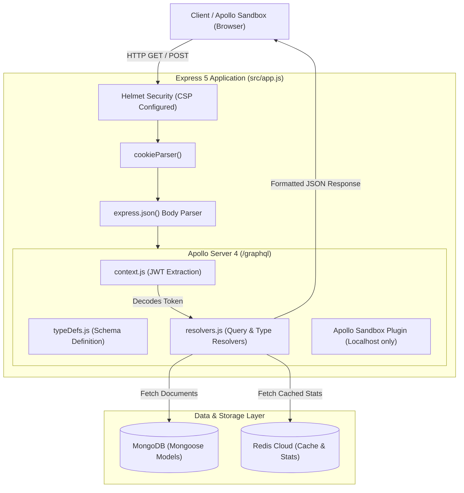

# 🚀 The Definitive Guide to GraphQL & Apollo Sandbox in AppointFlow

Welcome to the comprehensive technical guide for **GraphQL** in AppointFlow. This guide covers the underlying architecture, directory structure, schema definitions, resolver execution pipeline, authentication context, security configuration, and step-by-step instructions for querying and extending your GraphQL API.

---

## 📑 Table of Contents
1. [What is GraphQL & Why Use It?](#1-what-is-graphql--why-use-it)
2. [High-Level Architecture](#2-high-level-architecture)
3. [Project Directory & File Structure](#3-project-directory--file-structure)
4. [How GraphQL Works in AppointFlow](#4-how-graphql-works-in-appointflow)
   * [1. Type Definitions (`typeDefs.js`)](#1-type-definitions-typedefsjs)
   * [2. Resolvers & Nested Fields (`resolvers.js`)](#2-resolvers--nested-fields-resolversjs)
   * [3. Authentication & Request Context (`context.js`)](#3-authentication--request-context-contextjs)
   * [4. Apollo Server 4 Engine (`apolloServer.js`)](#4-apollo-server-4-engine-apolloserverjs)
   * [5. Express 5 Mounting & Security (`app.js`)](#5-express-5-mounting--security-appjs)
5. [Localhost-Only Apollo Sandbox Configuration](#5-localhost-only-apollo-sandbox-configuration)
6. [Interactive Query Guide (With Real Examples)](#6-interactive-query-guide-with-real-examples)
7. [How to Extend: Adding New Queries & Mutations](#7-how-to-extend-adding-new-queries--mutations)
8. [Performance, Caching & Best Practices](#8-performance-caching--best-practices)

---

## 1. What is GraphQL & Why Use It?

### The REST vs. GraphQL Paradigm
In a traditional REST architecture, clients make multiple round-trip HTTP calls to fixed endpoints (e.g., `GET /service`, `GET /auth/staff`, `GET /booking`) and receive fixed data structures, often resulting in:
* **Over-fetching**: Receiving 50 fields when the frontend only needed the `name` and `price`.
* **Under-fetching / Waterfall Requests**: Making 3 sequential API requests to assemble a single dashboard screen.

**GraphQL** is a query language and runtime for APIs that gives clients the power to ask for **exactly what they need and nothing more**:

```graphql
# A single request fetches Organization, Services, and Staff simultaneously!
query {
  org(slug: "appointflow-demo") {
    name
    plan
  }
  services(orgId: "6a91241545540a60ac3776c6") {
    name
    price
  }
  staff(orgId: "6a91241545540a60ac3776c6") {
    name
    email
  }
}
```

---

## 2. High-Level Architecture



---

## 3. Project Directory & File Structure

All GraphQL-specific logic is modularized in `src/graphql/`:

```
b:/NEW Project/
├── src/
│   ├── graphql/
│   │   ├── typeDefs.js       # GraphQL Schema Definition (types, queries, enums)
│   │   ├── resolvers.js      # Resolver functions for root queries and nested fields
│   │   ├── context.js        # Extracts JWT cookie / Authorization header into context
│   │   └── apolloServer.js   # ApolloServer instance factory & Sandbox plugins
│   ├── models/               # Existing Mongoose Models (User, Org, Service, Booking...)
│   ├── config/               # Redis & Database connections
│   ├── app.js                # Mounts expressMiddleware(apolloServer) at /graphql
│   └── server.js             # Starts the Node HTTP server
└── tests/
    └── graphql.test.js       # Vitest automated test suite for GraphQL schema & resolvers
```

---

## 4. How GraphQL Works in AppointFlow

### 1. Type Definitions (`typeDefs.js`)
`typeDefs` define the strict type contract of your GraphQL API using Schema Definition Language (SDL).

```javascript
// src/graphql/typeDefs.js
export const typeDefs = `#graphql
  enum UserRole {
    owner
    staff
    customer
  }

  type User {
    _id: ID!
    name: String!
    email: String!
    role: UserRole!
    orgId: ID!
  }

  type Booking {
    _id: ID!
    date: String!
    startAt: String!
    endAt: String!
    status: String!
    price: Float!
    # Nested field resolvers:
    customer: User
    staff: User
    service: Service
  }

  type Query {
    health: String!
    me: User
    org(id: ID, slug: String): Org
    services(orgId: ID!): [Service!]!
    bookings(orgId: ID, date: String): [Booking!]!
    todayStats(staffId: ID): StaffStats
  }
`;
```

> **Key Rule**: The exclamation mark `!` denotes a non-nullable field (e.g. `name: String!` must always return a string, never `null`).

---

### 2. Resolvers & Nested Fields (`resolvers.js`)
Resolvers are the functions that supply data for each field in the schema. Every resolver receives 4 arguments:
1. `parent`: The result returned by the previous resolver in the execution tree.
2. `args`: The parameters provided in the GraphQL query (e.g., `{ orgId: "..." }`).
3. `context`: Shared per-request state (authenticated `user`, `req`, `res`).
4. `info`: AST containing details about the execution state.

#### Root Query Resolvers:
```javascript
// src/graphql/resolvers.js
export const resolvers = {
  Query: {
    // 1. Fetch organization by ID or slug
    org: async (_, { id, slug }) => {
      if (id) return Org.findById(id);
      if (slug) return Org.findOne({ slug });
      return null;
    },

    // 2. Fetch active services for an organization
    services: async (_, { orgId }) => {
      return Service.find({ orgId, active: true });
    },

    // 3. Return the authenticated user from JWT context
    me: async (_, __, { user }) => {
      return user;
    },
  },
```

#### Relational / Nested Field Resolvers:
When a client requests `bookings { customer { name } service { price } }`, GraphQL executes the `Booking` field resolvers on demand:

```javascript
  Booking: {
    customer: async (parent) => {
      return User.findById(parent.customerId).select('-passwordHash');
    },
    staff: async (parent) => {
      return User.findById(parent.staffId).select('-passwordHash');
    },
    service: async (parent) => {
      return Service.findById(parent.serviceId);
    },
  },
};
```

---

### 3. Authentication & Request Context (`context.js`)
GraphQL requests execute through the `buildGraphQLContext` function. It inspects incoming HTTP cookies and `Authorization: Bearer <token>` headers to hydrate the user without rejecting unauthenticated queries:

```javascript
// src/graphql/context.js
import jwt from 'jsonwebtoken';
import { User } from '../models/user.model.js';

export const buildGraphQLContext = async ({ req, res }) => {
  let user = null;
  try {
    let token = req.cookies?.token;
    const authHeader = req.headers?.authorization;

    if (!token && authHeader?.startsWith('Bearer ')) {
      token = authHeader.split(' ')[1];
    }

    if (token) {
      const decoded = jwt.verify(token, process.env.JWT_SECRET);
      if (decoded?._id) {
        user = await User.findById(decoded._id).select('-passwordHash');
      }
    }
  } catch (err) {
    user = null; // Unauthenticated guest
  }

  return { user, req, res };
};
```

---

### 4. Apollo Server 4 Engine (`apolloServer.js`)
We configure Apollo Server to dynamically enable **Apollo Sandbox** on localhost, while hardening production:

```javascript
// src/graphql/apolloServer.js
import { ApolloServer } from '@apollo/server';
import { ApolloServerPluginLandingPageLocalDefault } from '@apollo/server/plugin/landingPage/default';
import { ApolloServerPluginLandingPageDisabled } from '@apollo/server/plugin/disabled';
import { typeDefs } from './typeDefs.js';
import { resolvers } from './resolvers.js';

const isProduction = process.env.NODE_ENV === 'production';

export const createApolloServer = () => {
  return new ApolloServer({
    typeDefs,
    resolvers,
    introspection: !isProduction, // Disabled in production
    plugins: [
      !isProduction
        ? ApolloServerPluginLandingPageLocalDefault({
            embed: true,          // Embedded Apollo Sandbox GUI
            includeCookies: true,  // Passes session cookies for auth
          })
        : ApolloServerPluginLandingPageDisabled(),
    ],
  });
};
```

---

### 5. Express 5 Mounting & Security (`src/app.js`)
Apollo Server is attached to the Express app via `expressMiddleware`. We adjust Helmet's Content Security Policy (CSP) so the browser allows the Apollo Sandbox iframe:

```javascript
// src/app.js
import { expressMiddleware } from '@apollo/server/express4';
import { createApolloServer } from './graphql/apolloServer.js';
import { buildGraphQLContext } from './graphql/context.js';

// Relax CSP only in development to allow Apollo Sandbox iframe & scripts
app.use(
  helmet({
    contentSecurityPolicy: process.env.NODE_ENV === 'production' ? undefined : false,
    crossOriginEmbedderPolicy: false,
  })
);

// Initialize Apollo Server
export const apolloServer = createApolloServer();
await apolloServer.start();

// Mount GraphQL middleware
app.use(
  '/graphql',
  cors({
    origin: (origin, callback) => callback(null, true),
    credentials: true,
  }),
  express.json(),
  (req, res, next) => {
    if (req.body === undefined) req.body = {};
    next();
  },
  expressMiddleware(apolloServer, {
    context: buildGraphQLContext,
  })
);
```

---

## 5. Localhost-Only Apollo Sandbox Configuration

When you navigate to `http://localhost:5052/graphql` in your browser:
1. Apollo Server serves a lightweight HTML page that loads the official **Apollo Studio Sandbox**.
2. The Sandbox automatically polls the GraphQL introspection schema and builds an interactive documentation explorer on the left.
3. You can click fields to build queries visually, pass variables in JSON, and test operations with real-time autocompletion.

> [!NOTE]
> In production environments (`NODE_ENV === 'production'`), Apollo Sandbox and schema introspection are automatically turned off to protect against unauthorized schema discovery.

---

## 6. Interactive Query Guide (With Real Examples)

Open `http://localhost:5052/graphql` and test these pre-built operations:

### Example 1: Full Organization & Service Directory
```graphql
query GetStudioDirectory {
  org(slug: "appointflow-demo") {
    _id
    name
    slug
    timezone
    plan
  }
  services(orgId: "6a91241545540a60ac3776c6") {
    _id
    name
    price
    durationMinutes
    description
  }
}
```

### Example 2: Nested Booking Relationships
```graphql
query GetBookingsWithRelations {
  bookings(orgId: "6a91241545540a60ac3776c6") {
    _id
    date
    startAt
    endAt
    status
    price
    customer {
      name
      email
    }
    staff {
      name
      email
    }
    service {
      name
      price
      durationMinutes
    }
  }
}
```

### Example 3: Staff Schedule & Live Performance Stats
```graphql
query GetStaffScheduleAndStats {
  availability(staffId: "6a91241645540a60ac3776c8") {
    dayOfWeek
    startTime
    endTime
  }
  todayStats(staffId: "6a91241645540a60ac3776c8") {
    totalBookings
    completed
    pending
    cancelled
  }
}
```

---

## 7. How to Extend: Adding New Queries & Mutations

To add a new feature (for example, a `cancelBooking` Mutation):

### Step 1: Update `src/graphql/typeDefs.js`
```graphql
type Mutation {
  cancelBooking(bookingId: ID!): Booking!
}
```

### Step 2: Add Resolver in `src/graphql/resolvers.js`
```javascript
export const resolvers = {
  Query: { ... },
  
  Mutation: {
    cancelBooking: async (_, { bookingId }, { user }) => {
      if (!user) {
        throw new Error('Authentication required');
      }

      const booking = await Booking.findById(bookingId);
      if (!booking) throw new Error('Booking not found');

      booking.status = 'cancelled';
      await booking.save();

      return booking;
    },
  },
  
  Booking: { ... }
};
```

---

## 8. Performance, Caching & Best Practices

1. **Redis Caching for Analytics**:
   * Resolvers like `todayStats` first query Redis hash keys (`staff-stats:<staffId>`). If a cache miss occurs, they query MongoDB and return clean fallbacks.
2. **Lean Projections**:
   * Sensitive fields (like `passwordHash`) are excluded by default via `.select('-passwordHash')`.
3. **Automated Testing**:
   * You can test your GraphQL resolvers and queries directly in Vitest using `apolloServer.executeOperation({ query: '...' })`.
   * Run `npm test` to verify all 65 test cases across 8 suites.

---

### ✅ Summary of URLs:
* **Apollo Sandbox**: `http://localhost:5052/graphql`
* **REST API Swagger**: `http://localhost:5052/api-docs/`
* **Frontend Portal**: `http://localhost:3000`
